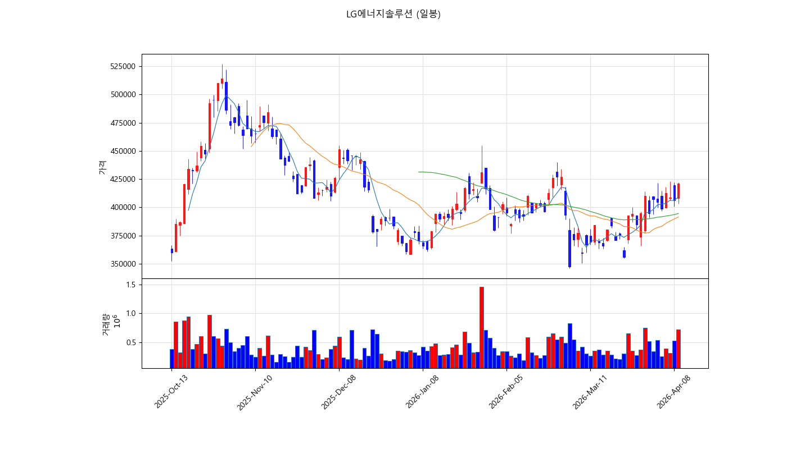
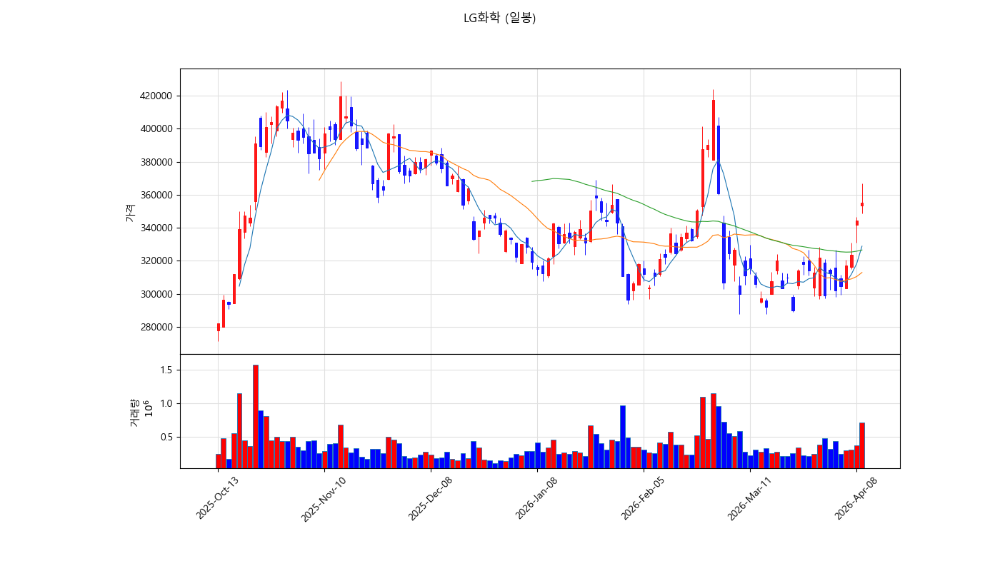
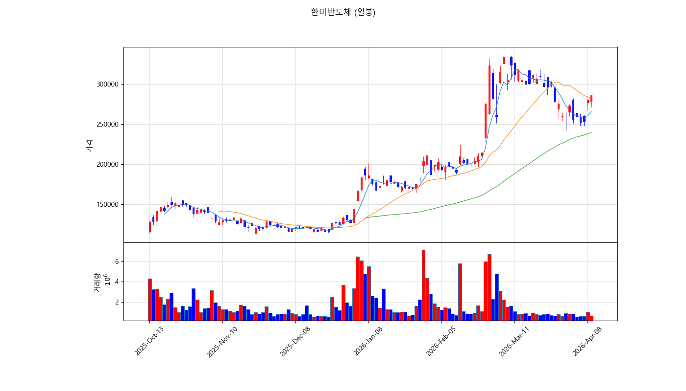
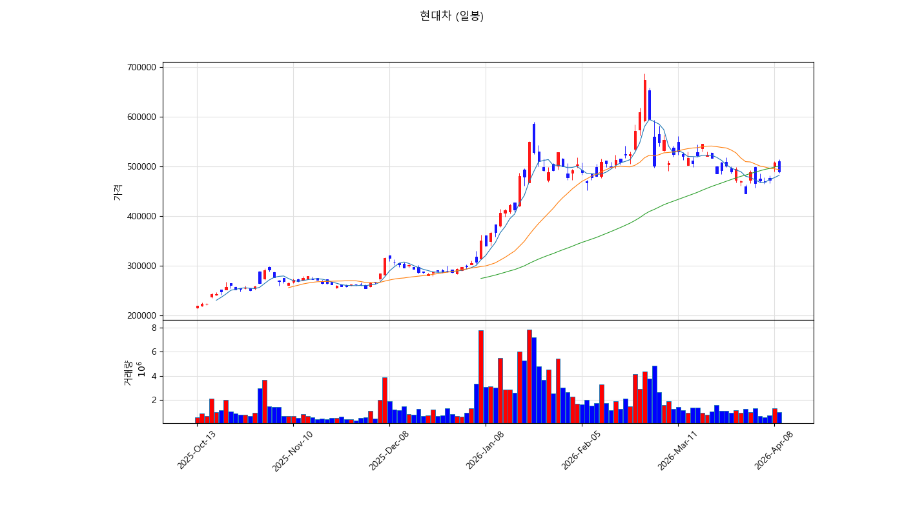

# 🔥 [4/9 마감리뷰] 트럼프 관세 폭탄에 반도체 휘청, 2차전지만 홀로 방긋

## 📌 한줄 요약
> 미국 증시 급등에도 불구하고 트럼프 관세 리스크가 반도체·자동차를 직격, 2차전지·화학만 역행 상승하며 시장은 극심한 양극화를 보였습니다.

---

## 📊 오늘의 시장 — 무슨 일이 있었나?

미국 증시가 나스닥 +3.26%까지 폭등하며 "이란 2주 휴전" 호재를 반영했지만, 정작 오늘 국내 시장은 **전혀 다른 그림**을 그렸습니다.

### 주요 종목 등락

| 구분 | 종목 | 종가 | 등락률 |
|------|------|------|--------|
| 🔺 상승 | LG에너지솔루션 | 421,000원 | **+3.69%** |
| 🔺 상승 | LG화학 | 355,000원 | **+3.05%** |
| 🔺 상승 | 한미반도체 | 286,000원 | **+1.96%** |
| 🔺 상승 | 삼성SDI | 480,000원 | **+1.80%** |
| 🔻 하락 | 삼성전자 | 204,000원 | **-3.09%** |
| 🔻 하락 | SK하이닉스 | 998,000원 | **-3.39%** |
| 🔻 하락 | 현대차 | 489,500원 | **-3.64%** |
| 🔻 하락 | 고려아연 | 1,526,000원 | **-3.72%** |

삼성전자가 21만원선에서 20.4만원으로 떨어지고, SK하이닉스도 100만원선이 무너졌습니다. 반면 LG에너지솔루션(+3.7%), LG화학(+3.1%)은 나홀로 강세. **시장의 "관세 회피처"로 2차전지가 부각**된 모습입니다.

---

## 🌍 왜 이렇게 됐나? — 매크로 & 외부 요인

### 1. 트럼프 관세 확대 → 반도체·자동차 직격탄
트럼프 대통령의 추가 관세 정책이 반도체와 자동차 수출에 직접적 타격을 주고 있습니다. 삼성전자(-3.1%), SK하이닉스(-3.4%), 현대차(-3.6%) 모두 관세 리스크에 대한 우려가 주가에 반영됐습니다.

### 2. 이란 휴전 소식 → 미국 증시 급등, 국내는 제한적
이란과의 2주 휴전 소식에 나스닥이 +3.26% 폭등했지만, 국내 시장은 이 호재를 이미 전일 선반영한 측면이 있고, 관세 이슈가 더 크게 작용했습니다.

### 3. 원/달러 환율 고공행진
고환율이 지속되면서 외국인 매도세가 대형주에 집중. 서학개미들이 미국 주식 순매도로 전환했다는 뉴스도 심리를 위축시켰습니다.

### 4. 2차전지 — 유럽 배터리 규제가 오히려 호재
유럽의 배터리 소재 현지 공급 요구가 강화되면서, 한국 2차전지 기업들의 유럽 수주 기대감이 커졌습니다. 관세와 무관한 섹터로서 **피난처 역할**을 하고 있습니다.

---

## 🚀 상승 종목 심층 분석

### LG에너지솔루션 (421,000원, +3.69%)
**상승 원인**: 증권사 목표가 상향 + "2분기부터 ESS 매출-이익 개선" 전망 보고서 발표

뉴스에서도 확인됩니다:
- *"LG에너지솔루션, 증권사 목표가 상향에 강세…3.2%"* — 매일경제
- *"2분기부터 ESS로 매출-이익 개선 가능할 듯"* — 금융소비자뉴스

### LG화학 (355,000원, +3.05%)
**상승 원인**: "2분기 고유가 후유증 예상되지만 전사 실적엔 유리" 분석 + 주총에서 팰리서 주주제안 부결로 경영 안정성 확보

뉴스 흐름:
- *장중 362,000원까지 5.08% 상승* — 톱스타뉴스
- *"역대급 주가 저평가" 지적에도 팰리서 제안 부결* — 지디넷코리아

### 한미반도체 (286,000원, +1.96%)
**상승 원인**: 전일 급락 후 기술적 반등 + 엔비디아 HBM 장비 수주 기대감 지속

뉴스 참고:
- *"엔비디아 덕에 76% 대박…개미들 '지금이라도 들어가?'"* — 한국경제
- *"한미반도체 주가 6% 도약…전일 급락 후 반등"* — CBC뉴스

---

## 📉 하락 종목 심층 분석

### 현대차 (489,500원, -3.64%)
**하락 원인**: 삼성증권이 "1분기 실적 예상치 하회" 전망 + 목표가 하향. 관세 직격탄을 맞는 자동차 업종 전체가 약세.

### 고려아연 (1,526,000원, -3.72%)
**하락 원인**: 베인캐피탈이 지분 6,000억원 규모 전량 매각 소식. MBK 경영권 분쟁이 지속되는 가운데 대규모 매물 출회가 수급 악화를 유발.

---

## 📈 차트 기술적 분석

### LG에너지솔루션 — 볼린저밴드 상단 돌파, 강세 지속

| 지표 | 값 | 해석 |
|------|-----|------|
| 현재가 | 421,000원 | MA5(409,300) 위에서 거래 |
| MA5/MA20/MA60 | 409,300 / 391,475 / 394,475 | **정배열 전환 중** |
| RSI(14) | 63.8 | 중립~강세, 과매수 아님 |
| MACD | +6,866 (시그널 +3,587) | **히스토그램 양전환, 상승 모멘텀** |
| 볼린저밴드 | 상단 426,906 / 중간 391,475 / 하단 356,043 | **상단 근접 돌파 시도** |
| 20일 고/저 | 423,000 / 355,000 | 20일 신고가 부근 |

**판단**: 5일선 > 20일선 > 60일선 정배열 전환 중이며, MACD 히스토그램이 양전환하며 상승 모멘텀이 살아나고 있습니다. 볼린저밴드 상단(426,906원)을 돌파하면 추가 상승 여력 충분.

---

### LG화학 — MACD 골든크로스, 반등 가속

| 지표 | 값 | 해석 |
|------|-----|------|
| 현재가 | 355,000원 | MA5(328,900) 대폭 상회 |
| MA5/MA20/MA60 | 328,900 / 312,975 / 326,558 | **단기선 급등, 정배열 전환 임박** |
| RSI(14) | 63.9 | 강세 진입, 아직 과매수 아님 |
| MACD | +2,751 (시그널 -2,622) | **골든크로스 완성! 히스토그램 +5,372** |
| 볼린저밴드 | 상단 344,660 | **상단 돌파! 강한 상승 시그널** |
| 20일 고/저 | 367,000 / 288,000 | 20일 신고가 갱신 |

**판단**: 볼린저밴드 상단(344,660원)을 돌파한 상태. MACD 골든크로스가 완성되어 중기 상승 추세 전환 신호. 다만 5일간 +19% 급등하여 단기 차익실현 물량에 주의.

---

### 한미반도체 — 하락 추세 속 반등 시도

| 지표 | 값 | 해석 |
|------|-----|------|
| 현재가 | 286,000원 | MA20(282,700) 소폭 상회 |
| RSI(14) | 42.2 | **약세 구간**, 아직 반등 초기 |
| MACD | -88.8 (시그널 +2,797) | **데드크로스 상태, 회복 필요** |
| 볼린저밴드 | 중간 282,700 | 중심선 부근에서 횡보 |

**판단**: 3월 고점(318,500원)에서 -18% 하락 후 반등 시도 중. RSI 42.2로 약세 구간이며, MACD가 여전히 데드크로스. 20일선(282,700) 위에서 지지가 확인되면 추가 반등 가능하나 아직 추세 전환 확인 전.

---

### 현대차 — 하락 추세 지속, 지지선 주의

| 지표 | 값 | 해석 |
|------|-----|------|
| 현재가 | 489,500원 | MA20(493,550) 아래 |
| RSI(14) | 44.4 | 약세 |
| MACD | -9,923 | **깊은 하락 추세** |
| 볼린저밴드 | 하단 445,143 | 하단 근접 시 지지 기대 |

**판단**: 60일선(500,750원) 아래로 밀린 상태. 관세 리스크가 해소되지 않는 한 기술적 반등은 제한적. 445,000원 볼린저밴드 하단이 최후 지지선.

---

## 🔮 종합 전망 & 매매 전략

### LG에너지솔루션 — ⭐⭐⭐⭐ 매수 유효

| 항목 | 가격 | 근거 |
|------|------|------|
| 🟢 진입 추천가 | 405,000~412,000원 | MA5(409,300) 부근 조정 시 |
| 🎯 1차 목표가 | 435,000원 | 볼린저 상단 돌파 확장 |
| 🎯 2차 목표가 | 460,000원 | 전고점 영역 |
| 🔴 손절가 | 390,000원 (-7%) | MA20 이탈 시 |

**근거**: ESS 매출 개선 전망 + 정배열 전환 + RSI 여력 충분. 관세 리스크와 무관한 피난처 성격.

---

### LG화학 — ⭐⭐⭐☆ 조건부 매수 (급등 후 조정 대기)

| 항목 | 가격 | 근거 |
|------|------|------|
| 🟢 진입 추천가 | 330,000~340,000원 | 조정 시 볼린저 상단(344,660) 부근 |
| 🎯 1차 목표가 | 370,000원 | 20일 신고가 근접 |
| 🎯 2차 목표가 | 400,000원 | 심리적 저항선 |
| 🔴 손절가 | 310,000원 (-8%) | MA20 이탈 |

**근거**: MACD 골든크로스 긍정적이나, 5일간 +19% 급등으로 단기 과열 주의. 조정 후 진입이 안전.

---

### 한미반도체 — ⭐⭐⭐☆ 관망 → 추세 확인 후 매수

| 항목 | 가격 | 근거 |
|------|------|------|
| 🟢 진입 추천가 | 270,000~280,000원 | 20일선(282,700) 지지 확인 후 |
| 🎯 1차 목표가 | 310,000원 | 3월 고점 회복 |
| 🔴 손절가 | 250,000원 (-10%) | 최근 저점 이탈 시 |

**근거**: 엔비디아 수혜 스토리는 유효하나, RSI 42로 약세 구간. MACD 골든크로스 전환까지 관망 권장.

---

### 현대차 — ⭐⭐☆☆ 매도 또는 관망

| 항목 | 가격 | 근거 |
|------|------|------|
| 🟢 진입 추천가 | 445,000원 이하 | 볼린저 하단 지지 확인 시에만 |
| 🔴 이미 보유 시 | 470,000원 이탈 시 비중 축소 권장 | |

**근거**: 관세 리스크 + 실적 하향 + 기술적 하락 추세 3중고. 정책 변화 없이는 반등 어려움.

---

## 📝 내일 주목할 포인트

1. **트럼프 관세 추가 발표 여부** — 반도체·자동차 관세 확대 시 추가 하락 가능
2. **이란 휴전 후속 진전** — 유가·방산주 방향성 결정
3. **LG에너지솔루션 볼린저 상단 돌파** — 426,900원 돌파 시 강한 상승 파동
4. **SK하이닉스 100만원선** — 심리적 지지선 붕괴 여부 (오늘 998,000원)
5. **원/달러 환율** — 고환율 지속 시 외국인 매도세 계속

---

## 🎯 섹터 전략 요약

| 섹터 | 판단 | 이유 |
|------|------|------|
| 🔋 2차전지 | **비중 확대** | 관세 무관 + 유럽 수주 모멘텀 + 기술적 상승 전환 |
| 💻 반도체 | **관망/축소** | 관세 직격 + SK하이닉스 100만원 붕괴 위험 |
| 🚗 자동차 | **비중 축소** | 관세 + 실적 하향 + 기술적 하락 |
| 🏦 금융 | **중립** | NAVER 0%, 신한지주 -0.1% 등 무풍지대 |
| 🛡️ 방산 | **주목** | 이란 휴전 단기 악재지만, 중장기 지정학 리스크 지속 |

---

> ⚠️ **면책조항**: 본 글은 투자 참고용이며, 특정 종목의 매수·매도를 권유하지 않습니다. 모든 투자 결정과 그에 따른 손익은 투자자 본인의 판단과 책임 하에 이루어져야 합니다. 과거의 수익률이 미래의 수익률을 보장하지 않습니다.

---

*2026.04.09 마감 | AI 기반 자동 분석 시스템 + 실시간 pykrx 데이터 기반 작성*
