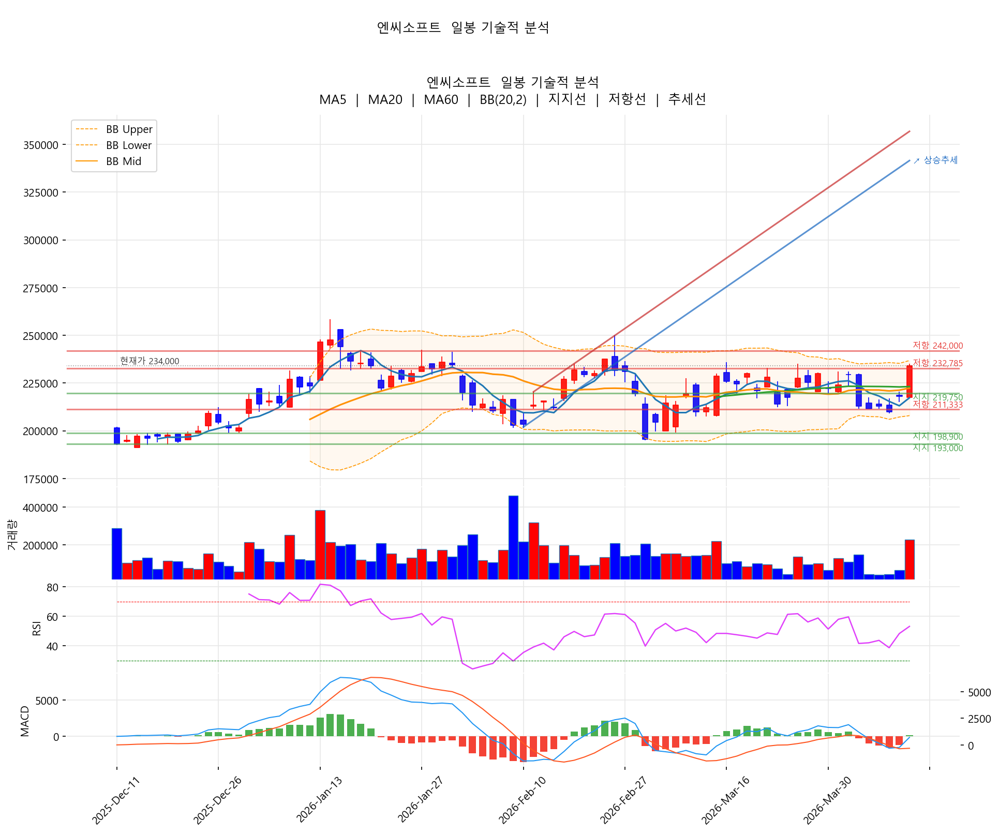
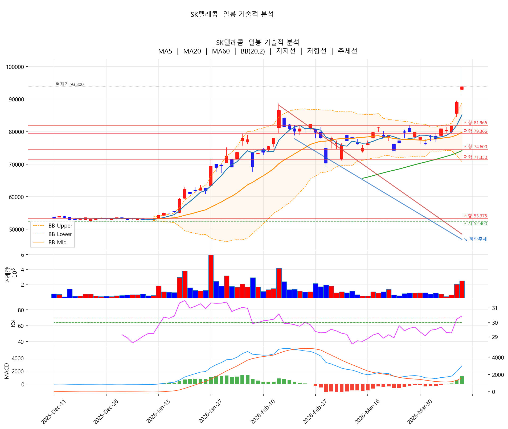
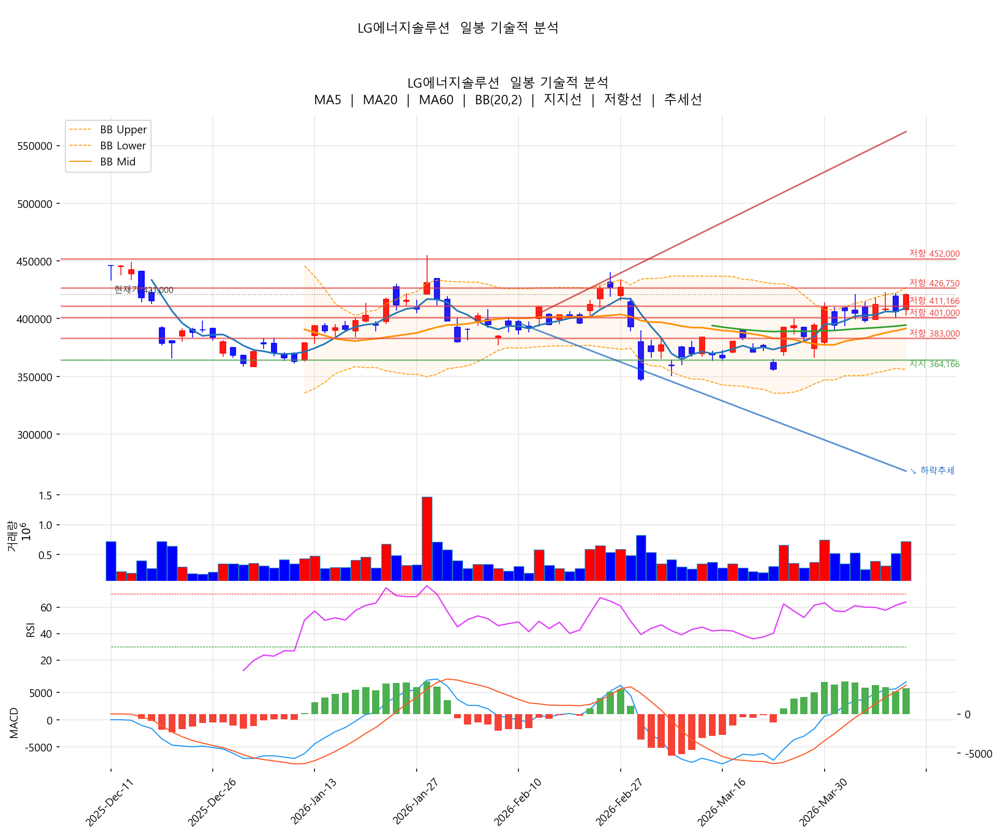
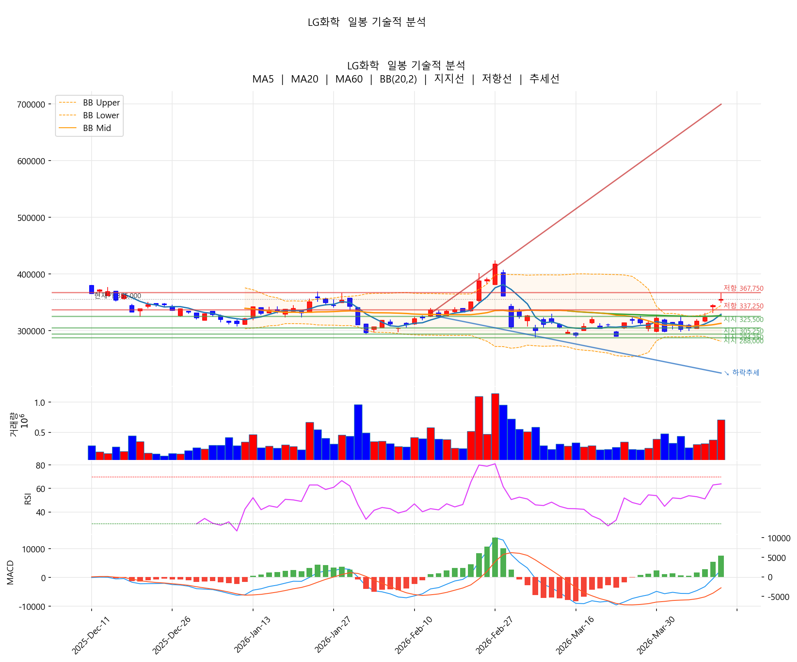
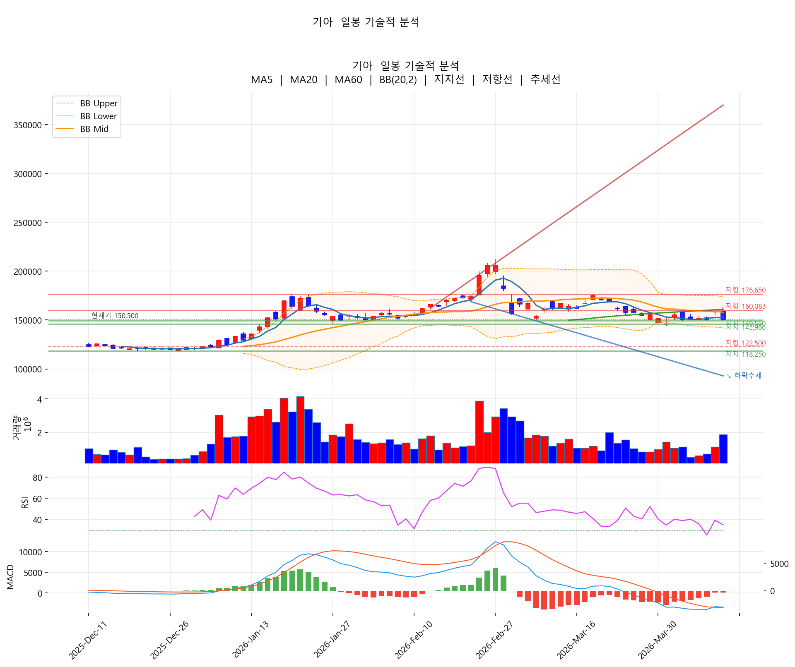
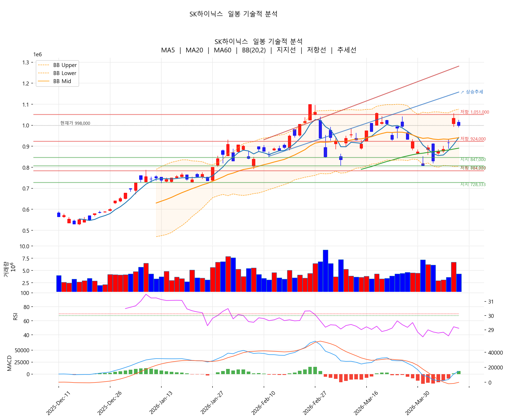
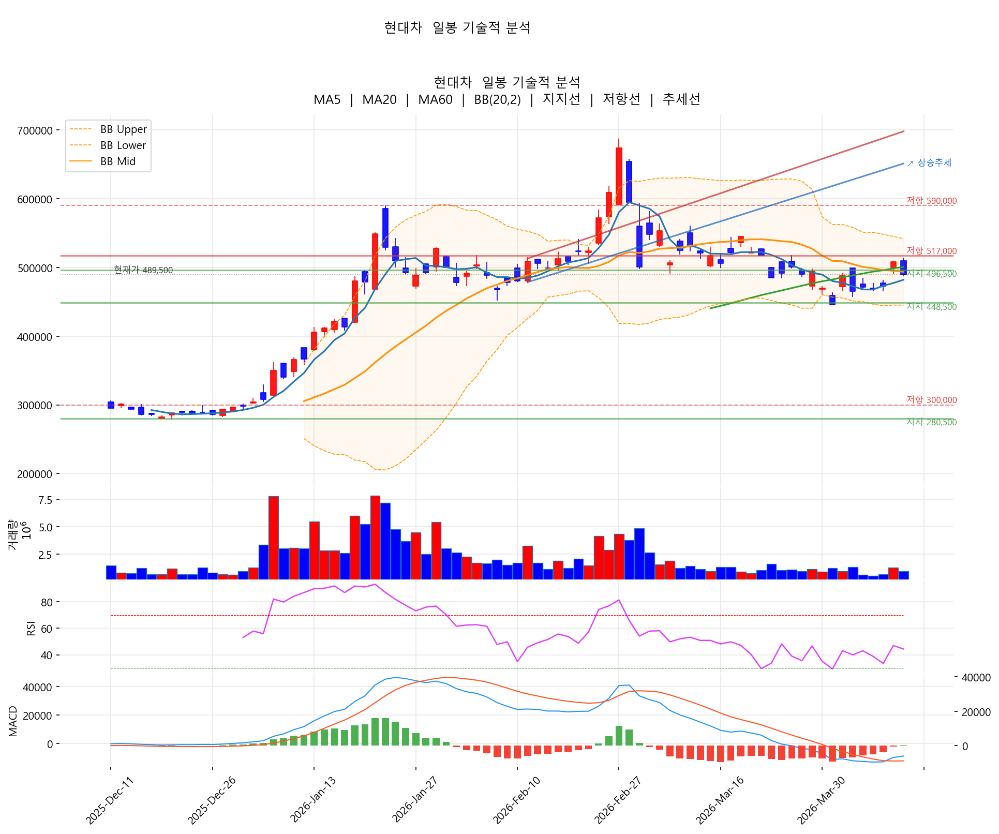

# 🔥 [4/9 마감] "어제 많이 올랐어, 일단 돈 챙겨" — 이란 휴전 랠리 하루 만에 차익실현 폭탄

## 📌 30초 요약
> 전일(4/8) 이란 휴전 소식에 코스피가 5800선을 돌파하고 매수 사이드카까지 발동되는 폭등장이 연출됐지만, 오늘(4/9)은 개인투자자 7조원대 순매도 차익실현이 쏟아지며 반도체·자동차가 일제히 하락했습니다. SK하이닉스 100만원선 붕괴, 기아 -5.5%. 반면 2차전지·엔씨소프트·SK텔레콤은 개별 모멘텀으로 역행 상승하며 극심한 양극화가 나타났습니다.

---

# PART 1. 📊 시장 전체 조감도

## 어제와 오늘, 완전히 다른 시장

4/8(어제)은 이란과의 2주 휴전 합의 소식에 시장이 폭발했습니다. 코스피 5800선 돌파에 매수 사이드카까지 발동됐고, SK하이닉스 +12.8%, 삼성전자 +7.1%, 현대차 +7.4%, 한미반도체 +10.7%라는 기록적인 급등이 나왔죠.

그런데 오늘, 분위기가 180도 달라졌습니다.

- "어제 많이 올랐어, 일단 돈 챙겨"...삼전닉스 줄줄이 차익실현 — 머니투데이
- '잘 벌고 갑니다' 중동 휴전에 개인 7조원대 순매도 차익실현 — 헤럴드경제
- 삼성전자·SK하이닉스, 차익실현 압력에 동반 약세 — 매일경제
- '6000피 탈환' 앞두고 숨고르기…전날 폭등에 따른 차익 실현 — 이데일리

### 4/8 → 4/9 주요 종목 변화

| 종목 | 4/8 종가 | 4/8 등락률 | 4/9 종가 | 4/9 등락률 | 해석 |
|------|------:|:---:|------:|:---:|------|
| 삼성전자 | 210,500원 | +7.12% | 204,000원 | -3.09% | 급등 되돌림 |
| SK하이닉스 | 1,033,000원 | +12.77% | 998,000원 | -3.39% | 100만원 붕괴 |
| 현대차 | 508,000원 | +7.40% | 489,500원 | -3.64% | 급등 반납 |
| 기아 | 159,200원 | +5.57% | 150,500원 | -5.46% | 상승분 이상 하락 |
| 주성엔지니어링 | 68,000원 | +12.40% | 63,800원 | -6.18% | 급등분 절반 반납 |
| 고려아연 | 1,585,000원 | +7.60% | 1,526,000원 | -3.72% | 베인캐피탈 매물 |
| 한미반도체 | 280,500원 | +10.65% | 286,000원 | +1.96% | 유일한 추가 상승 |
| LG에너지솔루션 | 406,000원 | -0.61% | 421,000원 | +3.69% | 어제 안 올라서 오늘 상승 |
| LG화학 | 344,500원 | +6.49% | 355,000원 | +3.05% | 연속 상승 (개별 모멘텀) |
| 엔씨소프트 | 218,000원 | +3.81% | 234,000원 | +7.34% | 리니지 클래식 흥행 |
| SK텔레콤 | 89,000원 | +9.07% | 93,800원 | +5.39% | 52주 신고가, AI 재평가 |
| 한화에어로스페이스 | 1,484,000원 | -3.45% | 1,451,000원 | -2.22% | 이란 휴전 = 방산 악재 |

패턴이 명확합니다. 4/8에 크게 올랐던 종목일수록 4/9에 크게 빠졌고, 4/8에 소외됐던 종목(LG에너지솔루션, 엔씨소프트)은 오히려 오늘 더 올랐습니다. 전형적인 "갭 메우기 + 순환매" 장세입니다.

## 섹터별 성적표

| 섹터 | 평균 전일비 | 5일 수익률 | 성격 |
|------|:---:|:---:|------|
| 🔋 2차전지 | +1.51% | +8.34% | 고유가 수혜 + ESS + 순환매 |
| 💻 IT/플랫폼 | +2.06% | +5.77% | 엔씨 서프라이즈 효과 |
| 🏦 금융 | -0.72% | +4.94% | 방어적 |
| 💊 바이오 | -1.00% | +2.85% | 무풍 |
| ⚙️ 반도체 | -2.77% | +7.70% | 전일 급등의 차익실현 |
| 🛡️ 방산/조선 | -2.80% | -1.75% | 휴전 = 모멘텀 약화 |
| 🚗 자동차 | -3.12% | +2.79% | 차익실현 + 실적 우려 |

## 전 종목 등락률

### 🔺 상승 종목

| 순위 | 종목 | 종가 | 전일비 | 5일 수익률 | 거래량 |
|:---:|------|------:|:---:|:---:|------:|
| 1 | 엔씨소프트 | 234,000원 | +7.34% | +10.64% | 226,733 |
| 2 | SK텔레콤 | 93,800원 | +5.39% | +15.95% | 2,478,327 |
| 3 | LG에너지솔루션 | 421,000원 | +3.69% | +5.65% | 719,468 |
| 4 | LG화학 | 355,000원 | +3.05% | +16.58% | 709,739 |
| 5 | SK이노베이션 | 124,000원 | +2.99% | +4.91% | 648,120 |
| 6 | 한미반도체 | 286,000원 | +1.96% | +10.00% | 646,513 |
| 7 | 삼성SDI | 480,000원 | +1.80% | +9.46% | 1,003,279 |
| 8 | LG전자 | 117,200원 | +0.43% | +8.22% | 1,188,521 |
| 9 | 삼성전기 | 516,000원 | +0.39% | +13.16% | 485,830 |
| 10 | 포스코퓨처엠 | 218,000원 | +0.23% | +3.07% | 399,050 |

### 🔻 하락 종목

| 순위 | 종목 | 종가 | 전일비 | 5일 수익률 | 거래량 |
|:---:|------|------:|:---:|:---:|------:|
| 1 | 주성엔지니어링 | 63,800원 | -6.18% | +2.57% | 1,037,520 |
| 2 | 기아 | 150,500원 | -5.46% | +0.20% | 1,878,867 |
| 3 | 고려아연 | 1,526,000원 | -3.72% | +2.83% | 29,220 |
| 4 | 현대차 | 489,500원 | -3.64% | +3.93% | 988,553 |
| 5 | SK하이닉스 | 998,000원 | -3.39% | +13.93% | 4,340,285 |
| 6 | 한화오션 | 123,500원 | -3.29% | -3.52% | 1,089,778 |
| 7 | 리노공업 | 113,100원 | -3.17% | +2.45% | 868,388 |
| 8 | 삼성전자 | 204,000원 | -3.09% | +9.56% | 26,431,837 |
| 9 | SK스퀘어 | 560,000원 | -3.11% | +15.94% | 478,849 |
| 10 | HD현대중공업 | 470,500원 | -2.89% | -1.88% | 500,179 |

---

# PART 2. 🌍 왜 이렇게 됐나?

## 1. 핵심: 전일 급등에 대한 대규모 차익실현

오늘 하락의 가장 큰 원인은 단순합니다. 어제 너무 많이 올랐습니다.

4/8에 코스피가 매수 사이드카 발동될 정도로 폭등했고, SK하이닉스가 하루에 +12.8% 올랐습니다. 이런 급등 다음 날 차익실현이 나오는 건 자연스러운 일이고, 실제로 개인투자자들이 7조원 규모 순매도를 쏟아냈습니다.

거래량 비교를 보면 성격이 더 드러납니다:
- 삼성전자: 4/8 대비 74% 수준 → 매수세가 빠지면서 자연 하락
- SK하이닉스: 4/8 대비 65% → 거래 줄며 하락, 패닉은 아님
- 기아: 4/8 대비 165% → 거래량 폭증 하락, 투매 성격

## 2. "불안한 휴전" — 호르무즈 해협 리스크

어제 시장을 폭등시킨 이란 휴전이지만, 하루 만에 분위기가 달라졌습니다.

- '불안한 휴전'에 원·달러도 불안…11.9원 오른 1,482.5원 마감 — 뉴시스
- 호르무즈 열리지만 '이란 통행료' 변수…유가·물류비 불안 여전 — 한겨레
- 호르무즈 재봉쇄에 국제유가↑…서울 경윳값도 2000원 돌파 — JTBC

휴전은 했지만 호르무즈 해협 통행 문제가 남아있어서, 어제의 "완전 해소" 기대가 오늘 "아직 불안하다"로 조정된 겁니다.

## 3. 환율 1,482원, 유가 재상승

원/달러가 11.9원 오른 1,482.5원으로 마감했고, 호르무즈 리스크에 국제유가도 다시 올랐습니다. 석유 3차 최고가격은 동결됐지만 경윳값은 2,000원을 돌파하는 등 실물 부담이 커지고 있습니다.

유가 상승은 2차전지·ESS 쪽에는 오히려 호재입니다. 대체에너지 수요가 커지니까요.

- 고유가에 2차전지주 주목...톱픽은 — 네이버 프리미엄콘텐츠
- 전쟁이 키운 ESS 시장…"반도체 다음은 2차전지" — DealSite

## 4. 금리: 미 연준에서 인상 목소리

- 美연준 '금리 인상' 목소리 커져…이란 전쟁發 인플레이션 우려 — 다음

중동 전쟁 → 유가 상승 → 인플레 우려 → 금리 인상 가능성. 이 흐름은 성장주(반도체, 기술주)에 부정적이고, 배당주(통신, 금융)에는 상대적으로 유리합니다.

---

# PART 3. 🚀 급등 종목 심층 분석

## 1. 엔씨소프트 (234,000원, +7.34%) — 리니지 클래식이 바꾼 판도

### 왜 올랐나

리니지 클래식의 흥행이 결정적이었습니다. 일간 매출 최고치가 100억원에 육박한다는 단독 보도가 나왔고, 증권가에서 목표가 상향이 잇따랐습니다. 거래량이 전일 대비 357% 폭증하며 기관·외국인 모두 매수에 가담한 것으로 보입니다.

관련 뉴스:
- [단독] 엔씨 '리니지 클래식' 일간 매출 최고치 100억원 육박 — MTN
- 엔씨소프트, '올해는 턴어라운드의 시작점' 증권사 발표에 강세 — 매일경제
- NH투자 '엔씨소프트 목표주가 33만원으로 상향' — 비즈니스포스트
- 엔씨, MSCI ESG 최고등급 'AAA' 한 단계 상승 — 헤럴드경제

### 차트 기술적 분석

차트를 보면 세 가지 중요한 근거가 보입니다.

첫째, 이동평균선 수렴 후 돌파입니다. MA5(217,300), MA20(222,375), MA60(223,151)이 222,000~223,000원대에 모여 있었는데, 오늘 234,000원으로 세 선을 한 번에 뚫었습니다. 이렇게 수렴된 이평선을 거래량과 함께 돌파하는 건 추세 전환의 교과서적 신호입니다.

둘째, 볼린저밴드 상단(236,811원)에 거의 닿았습니다. 현재 234,000원이니 2,800원 차이. 이 밴드를 돌파하면 밴드워크(밴드를 타고 상승)가 시작될 수 있고, 실패하면 단기 눌림이 옵니다.

셋째, MACD 히스토그램이 양전환했습니다. 차트 하단 MACD 패널에서 빨간 막대(음)가 초록 막대(양)로 바뀌기 시작한 게 보입니다. 골든크로스 직전 상태입니다.

다만 RSI 패널을 보면 53.1로 아직 과매수는 아니지만, 스토캐스틱이 96.2로 극단적 과매수라서 1~2일 쉬어가는 흐름이 나올 수 있습니다. 조정 시 이평선 수렴대(222,000원 부근)에서 지지 여부를 확인하면 됩니다.

---

## 2. SK텔레콤 (93,800원, +5.39%) — 통신주에서 AI 관련주로

### 왜 올랐나

시장이 SK텔레콤을 더 이상 통신주로 보지 않습니다. AI 사업 확장에 대한 재평가가 진행되며 52주 신고가를 경신했고, 장중 99,700원까지 올라갔습니다. "주가 10만원까지 가나"라는 기사까지 나올 정도입니다.

관련 뉴스:
- SK텔레콤 52주 신고가 찍었다…주가 10만원까지 가나 — 매일경제
- 통신주가 아니라 AI 관련주가 된 SKT — 네이버
- 영업익 40% 줄었는데 주가는 천장…SK텔레콤의 '반전' 이유 — 한국경제
- [특징주] 증권가 "가장 높은 이익·배당" 전망에 강세 — 글로벌이코노믹

### 차트 기술적 분석

차트에서 가장 먼저 눈에 들어오는 건 완벽한 정배열입니다. MA5 > MA20 > MA60 > MA120이 순서대로 위에서 아래로 배열돼 있고, 간격도 벌어지고 있습니다. 이건 상승 추세가 가속하고 있다는 뜻입니다.

볼린저밴드를 보면 현재가 93,800원이 상단(88,851원)을 크게 돌파해 있습니다. 일반적으로 밴드 밖으로 나가면 되돌림을 기대하지만, 강한 추세장에서는 오히려 "밴드워크"가 나타나며 밴드 상단을 타고 올라갑니다. 60일간 52,600원에서 93,800원까지 +78% 올랐는데 거래량도 2.8배로 뒷받침되고 있어 이 경우에 해당합니다.

RSI가 72.2로 과매수 구간에 진입했고, 차트에 그려진 70선을 넘어선 상태입니다. 단기적으로 숨고르기가 올 수 있지만, 추세 자체가 꺾이는 건 아닙니다.

MACD는 시그널선 위에서 히스토그램이 초록색으로 커지고 있어 모멘텀이 여전히 강합니다.

---

## 3. LG에너지솔루션 (421,000원, +3.69%) — 고유가가 키운 2차전지

### 왜 올랐나

세 가지가 겹쳤습니다. 호르무즈 리스크로 유가가 다시 오르면서 대체에너지(ESS·배터리) 기대감이 확대됐고, 전일에 -0.61%로 거의 안 올랐기 때문에 순환매 자금이 유입됐으며, 증권사들의 ESS 매출-이익 개선 전망도 호재로 작용했습니다.

관련 뉴스:
- 2분기부터 ESS로 매출-이익 개선 가능할 듯 — 금융소비자뉴스
- 고유가에 2차전지주 주목...톱픽은 — 네이버 프리미엄콘텐츠
- LG에너지솔루션, 올해 ESS 시황 기대 이상…목표가↑ — 한국경제

### 차트 기술적 분석

차트에서 주목할 포인트는 볼린저밴드 상단 돌파 시도입니다. 현재가 421,000원이 볼린저 상단(426,906원)에 거의 닿아 있고, 밴드가 수축 후 확장하기 시작하는 국면입니다. 밴드 수축→확장은 큰 방향성 움직임의 전조이고, 상방으로 확장되면 추세 상승이 본격화됩니다.

이동평균선을 보면 MA5(409,300)가 MA20(391,475)을 넘어서 정배열 전환이 진행 중입니다. MA60(394,475)과 MA20이 비슷한 위치에 있어서, 이 둘을 함께 돌파한 셈이라 의미가 큽니다.

차트 하단 MACD 패널에서 히스토그램이 뚜렷하게 초록색으로 커지고 있고, MACD선이 시그널선 위에 확실히 올라서 있습니다. 이건 상승 모멘텀이 가속되고 있다는 증거입니다.

RSI는 63.8로 강세 구간이지만 70(과매수)까지 여유가 있어서 추가 상승 여력이 충분합니다.

지지/저항선을 보면 저항선이 430,000원대, 450,000원대에 있고, 지지선이 390,000~400,000원대에 형성돼 있습니다. 볼린저 상단을 돌파하면 다음 저항인 450,000원(60일 고점)까지 열리는 구조입니다.

---

## 4. LG화학 (355,000원, +3.05%) — MACD 골든크로스, 바닥 탈출

### 왜 올랐나

"더 하락할 물량도 없어…바닥 다지는 LG화학"(아시아경제)이라는 분석이 시장에서 공감을 얻고 있고, 양극재 40% 성장 자신감이라는 긍정적 전망도 나왔습니다.

관련 뉴스:
- 더 하락할 물량도 없어…바닥 다지는 LG화학 — 아시아경제
- LG화학, 실적 개선·LGES 지분 활용 기대...목표주가 50만원↑ — 마켓인
- 2026년 양극재 40% 성장 자신감 — 네이버

### 차트 기술적 분석

LG화학 차트에서 가장 중요한 건 MACD 골든크로스입니다. 차트 맨 아래 MACD 패널을 보면, 파란색 MACD선이 주황색 시그널선을 아래에서 위로 교차한 게 보입니다. 히스토그램도 빨간→초록으로 전환됐고 크기가 급격히 커지고 있습니다. 이건 하락 모멘텀이 상승으로 전환됐다는 강한 신호입니다.

볼린저밴드를 보면 현재가 355,000원이 상단(344,660원)을 이미 돌파한 상태입니다. 밴드 밖에서 거래되고 있다는 건 변동성이 급격히 커지면서 추세가 형성되고 있다는 뜻이고, 거래량이 평소의 2.2배로 뒷받침되고 있어 "가짜 돌파"가 아닌 "진짜 돌파"일 가능성이 높습니다.

다만 5일간 +16.6% 급등했기 때문에 단기 과열 주의가 필요합니다. 추격 매수보다는 볼린저 상단(344,660원) 부근으로 눌렸을 때 잡는 전략이 안전합니다.

---

# PART 4. 📉 급락 종목 심층 분석

## 1. 기아 (150,500원, -5.46%) — 차익실현 + 실적 우려

4/8에 +5.57% 올랐는데 오늘 -5.46%로 상승분을 전부 반납하고도 더 빠졌습니다. 거래량이 전일 대비 165%로 폭증한 건 단순한 차익실현이 아니라 투매 성격의 매도가 나왔다는 뜻입니다. 삼성증권이 현대차 1분기 실적 하향 + 목표가 하향 리포트를 내면서 자동차 섹터 전체의 심리가 위축됐습니다.

### 차트 기술적 분석

기아 차트는 하락 추세의 전형적인 모습을 보여줍니다.

이동평균선이 MA5 < MA20 < MA60으로 완전 역배열입니다. 차트에 그려진 하락 추세선(고점 연결 빨간 선)이 위에서 눌러주고 있고, 주가가 이 선 아래에서 계속 거래되고 있어 하락 추세가 유효합니다.

RSI가 35.0으로 차트의 30선(초록 점선)에 가까워지고 있습니다. 30 아래로 내려가면 과매도 영역인데, 그 부근에서 기술적 반등이 나올 수 있습니다. 하지만 RSI 반등이 추세 반전을 의미하진 않습니다.

MACD도 시그널선 아래에서 히스토그램이 빨간색으로 유지되고 있어 하락 모멘텀이 살아있습니다.

볼린저밴드 하단(142,069원)이 차트에 보이는 최종 지지선입니다. 여기가 깨지면 130,000원대까지 열리는 구조입니다.

---

## 2. SK하이닉스 (998,000원, -3.39%) — 100만원 심리적 지지선 붕괴

전일 +12.8% 폭등의 차익실현입니다. 100만원이라는 심리적 가격대가 무너졌지만, 거래량이 4/8 대비 65%로 줄었다는 건 패닉 매도가 아닌 정상적 조정이라는 뜻입니다.

관련 뉴스:
- "36만전자·180만닉스 시대 온다"…사상 최대 실적 예상에 목표가 줄상향 — 조선일보
- 1·2분기 영업이익 40조·60조 전망 — 비즈니스포스트
- 이란 사태에 15% 빠진 삼성전자·SK하이닉스…"지금이라도 사라" — 연합인포맥스

### 차트 기술적 분석

SK하이닉스 차트에서 가장 중요한 포인트는 정배열이 유지되고 있다는 겁니다. 오늘 -3.4% 빠졌지만 MA5(941,800) > MA20(940,550) > MA60(890,983) 구조가 그대로입니다. 상승 추세선(저점 연결 파란 선)도 아직 유효합니다.

차트에 보이는 지지선 중 940,000원대(MA5·MA20 합류점)가 1차 지지입니다. 여기가 버텨주면 100만원 재탈환이 가능하고, 깨지면 890,000원(MA60)까지 밀릴 수 있습니다.

MACD 히스토그램이 여전히 초록색(양)을 유지하고 있는 게 긍정적입니다. 이건 오늘 하락에도 불구하고 중기 상승 모멘텀이 살아있다는 뜻입니다. RSI도 49.4로 정확히 중립이라 과매도가 아닙니다.

결론적으로 차트가 말하는 건 "조정이지 추세 전환이 아니다"입니다. 1·2분기 영업이익 40조·60조라는 실적 전망이 뒷받침되는 한 재차 상승 가능합니다.

---

## 3. 현대차 (489,500원, -3.64%)

삼성증권의 1분기 실적 하향 + 목표가 하향이 직접적 원인. 차익실현도 겹쳤습니다.

### 차트 기술적 분석

현대차는 역배열 상태(MA5 < MA20 < MA60)이고, 차트의 하락 추세선 아래에서 거래되고 있습니다. MACD도 시그널선 아래에서 맴돌고 있어 뚜렷한 반전 신호가 없습니다. 볼린저 하단(445,143원)이 최종 방어선이고, 여기까지 하락하면 기술적 반등은 나올 수 있지만 추세 자체가 바뀌려면 MA20(493,550원)을 넘어서야 합니다.

---

# PART 5. 🔮 종합 전망 & 매매 전략

## 오늘 시장의 진짜 메시지

이란 휴전은 단기 재료였습니다. 4/8에 한 번에 반영하고, 4/9에 되돌렸습니다.

차익실현에 흔들리지 않고 상승한 종목들의 공통점은 개별 펀더멘탈 모멘텀이 있다는 겁니다.
- 엔씨소프트: 리니지 클래식 매출 100억
- SK텔레콤: AI 관련주 재평가
- LG에너지솔루션: 고유가 수혜 + ESS
- LG화학: 바닥 탈출 + MACD 골든크로스

"개별 모멘텀이 있는 종목만 살아남는 종목장"이라는 게 오늘의 핵심입니다.

## 매수 추천

### LG에너지솔루션 — 매수

| 항목 | 가격 | 근거 |
|------|------|------|
| 진입가 | 405,000~412,000원 | MA5 부근 조정 시 |
| 1차 목표 | 435,000원 | 볼린저 상단 돌파 확장 |
| 2차 목표 | 455,000원 | 60일 고점 |
| 손절 | 390,000원 | MA20 이탈 시 |

정배열 전환 + RSI 여력 + 고유가 수혜 + ESS 모멘텀. 차트상 볼린저 상단 돌파 시 455,000원까지 열림.

### LG화학 — 조정 대기 후 매수

| 항목 | 가격 | 근거 |
|------|------|------|
| 진입가 | 330,000~340,000원 | 볼린저 상단 되돌림 시 |
| 1차 목표 | 380,000원 | |
| 2차 목표 | 420,000원 | 60일 고점 |
| 손절 | 310,000원 | MA20 이탈 시 |

MACD 골든크로스 + 볼린저 돌파. 다만 5일 +16.6% 급등이라 추격은 위험. 눌림에서 잡기.

### SK하이닉스 — 100만원 회복 확인 후 매수

| 항목 | 가격 | 근거 |
|------|------|------|
| 진입가 | 1,000,000~1,020,000원 | 100만원 안착 확인 |
| 1차 목표 | 1,100,000원 | 60일 고점 |
| 손절 | 940,000원 | MA5·MA20 이탈 |

정배열 유지 + MACD 양전환 + 사상 최대 실적 전망. 차트가 "조정이지 추세 전환 아니다"라고 말하고 있음.

### 엔씨소프트 — 단기 조정 후 매수

| 항목 | 가격 | 근거 |
|------|------|------|
| 진입가 | 220,000~225,000원 | 이평선 수렴대 지지 확인 |
| 1차 목표 | 250,000원 | 60일 고점 방향 |
| 손절 | 210,000원 | 최근 저가 이탈 |

이평선 3개 동시 돌파 + 리니지 클래식 매출 100억 + ESG AAA. 다만 스토캐스틱 96 과매수라 1~2일 눌림 예상.

## 매도 / 회피

- 기아: 역배열 + 실적 하향 + 투매 거래량. 155,000원 이탈 시 비중 축소, 142,000원이 최종 지지.
- 현대차: 역배열 + 실적 하향. 470,000원 이탈 시 손절.
- 고려아연: 베인캐피탈 6,000억 매물 + 경영권 분쟁 + 역배열. 수급 정상화 전까지 회피.

---

# PART 6. 📝 내일 주목할 포인트

1. 차익실현 소화 여부 — 오늘 7조원 순매도 후 내일 매도 압력이 줄어드는지. 줄면 반등, 지속되면 추가 하락.
2. SK하이닉스 100만원 탈환 — 심리적 지지선 회복 시 반도체 전체에 긍정.
3. 호르무즈 해협 후속 뉴스 — 이란 통행료 협상, 재봉쇄 여부. 유가·환율·시장 전체에 영향.
4. 원/달러 환율 — 1,482원에서 추가 상승 시 외국인 매도 가속.
5. LG에너지솔루션 볼린저 돌파 (426,906원) — 돌파 시 455,000원까지 공간.
6. 엔씨소프트 과매수 해소 — 스토캐스틱 80 아래로 내려오면 재매수 타이밍.
7. 미 연준 금리 인상 관련 발언 — 인상 목소리가 커지면 성장주에 부정적.

### 섹터 전략

| 섹터 | 전략 | 비중 | 핵심 근거 |
|------|------|:---:|------|
| 🔋 2차전지 | 적극 매수 | ▲▲ | 고유가 수혜 + ESS + 정배열 전환 |
| 📱 통신/AI | 선별 매수 | ▲ | SKT AI 재평가, 배당+성장 |
| 🎮 게임 | 조정 후 매수 | → | 엔씨 과매수, 눌림 대기 |
| 💻 반도체 | 관망 → 반등 시 매수 | → | 차익실현 소화 + 실적 기대 |
| 🏦 금융 | 중립 | → | 배당 매력, 모멘텀 부재 |
| 🚗 자동차 | 비중 축소 | ▼▼ | 실적 하향 + 투매 |
| 🛡️ 방산/조선 | 관망 | ▼ | 휴전 악재, 재개전 시 재매수 |

---

> ⚠️ 면책조항: 본 글은 투자 참고용이며, 특정 종목의 매수·매도를 권유하지 않습니다. 모든 분석은 과거 데이터와 현재 뉴스를 기반으로 한 것이며, 시장 상황은 언제든 변할 수 있습니다. 모든 투자 결정과 그에 따른 손익은 투자자 본인의 판단과 책임 하에 이루어져야 합니다.

---

*2026.04.09 마감 | pykrx 실시간 데이터 + Google News RSS 기반 | AI 자동 분석 시스템*
*분석 대상: 40개 주요 종목 / 7개 섹터 / 24개 뉴스 키워드*
